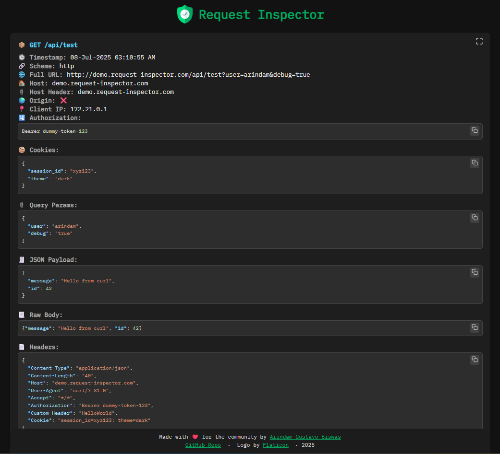
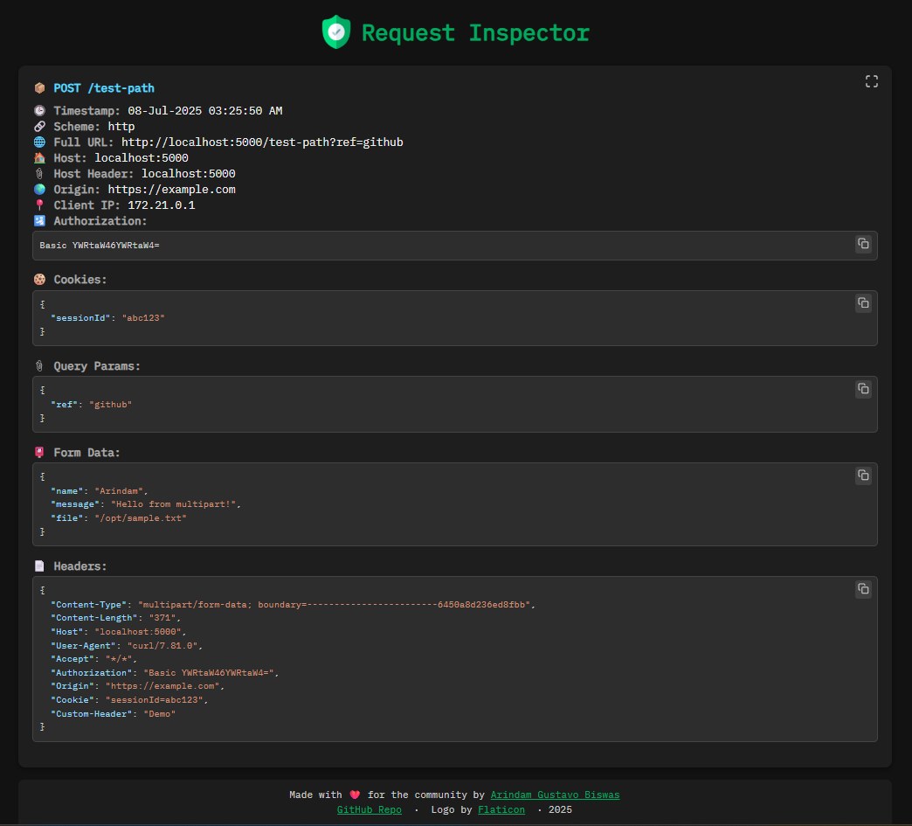

<h1>
   Request Inspector 
</h1>


**`Request Inspector`** is a real-time HTTP request viewer that displays incoming request details in a structured frontend UI. It’s built with a Python Flask backend (using WebSockets via `Flask-SocketIO`) and a React frontend. This tool is useful for debugging webhooks, inspecting API calls during development, and monitoring request flows in real-time.

## 🧩 Key Features

- Debug webhooks, API integrations, or client requests.
- Monitor incoming requests in real-time using WebSockets.
- Analyze headers, payloads, cookies, and other metadata.
- Copy-to-clipboard and syntax-highlighted JSON viewer
- Fullscreen viewing for individual requests
- Run a local endpoint to test how services are sending data to you.

---

## 🛠️ When is it useful?

- Testing incoming webhooks
- Debugging integrations between microservices.
- Verifying the format and content of HTTP requests.
- Teaching or demonstrating how HTTP requests work.

---

## 🐳 Running the Project with Docker

### Step 1: Clone the Repository

```bash
git clone https://github.com/arindamgb/request-inspector.git
cd request-inspector
```

### Step 2: Setup Frontend .env File

```
# Backend URL for the frontend to connect to the backend server.
REACT_APP_BACKEND_URL=http://localhost:5000
```

You can adjust these values as per your environment.

### Step 3: Setup Backend .env File

```
# Number of requests stored in the backend
MAX_REQUEST_LOGS=10
# Number of clients allowed to connect to the backend
MAX_CLIENTS=3
# Timezone for the request logging and display
TIMEZONE=Asia/Dhaka
```

Also adjust these values if needed.

### Step 4: Start the Application

Run using the images from `Dockerhub`

```
bash run.sh
```

Or, build the image locally and run

```
bash build-and-run.sh
```

`Frontend` will run at `http://localhost:3000` and `Backend` at `http://localhost:5000`

### Step 5: See it in Action

Send below request using curl

```
curl -X GET "http://localhost:5000/api/test?user=arindam&debug=true" \
  -H "Content-Type: application/json" \
  -H "Authorization: Bearer dummy-token-123" \
  -H "Custom-Header: HelloWorld" \
  -H "Cookie: session_id=xyz123; theme=dark" \
  -H "Host: demo.request-inspector.com" \
  -d '{"message": "Hello from curl", "id": 42}' \
  -v
```

You will see the details in Frontend instantly as below:




Let's try another request having `Content-Type` of `multipart/form-data`.

```
curl -X POST http://localhost:5000/test-path?ref=github \
  -H "Authorization: Basic YWRtaW46YWRtaW4=" \
  -H "Origin: https://example.com" \
  -H "Cookie: sessionId=abc123" \
  -F "name=Arindam" \
  -F "message=Hello from multipart!" \
  -F "file=/opt/sample.txt" \
  -H "Custom-Header: Demo" \
  -v
  ```

 Now we get:

 
  

  ### Step 6: Remove the Application

```
bash remove.sh
```

## 🔎 Request Fields Explained

| Field             | Description                                                                                      |
| ----------------- | ------------------------------------------------------------------------------------------------ |
| **Timestamp**     | Time when the request was received, shown in your configured timezone                            |
| **Method**        | HTTP method used (`GET`, `POST`, etc.)                                                           |
| **Scheme**        | Whether the request used HTTP or HTTPS                                                           |
| **Path**          | Endpoint path, e.g., `/api/test`                                                                 |
| **Full URL**      | The full requested URL including domain and query                                                |
| **Host**          | Server name/address as seen by the backend (may come from socket if Host header is missing)      |
| **Host Header**   | `Host` value from the incoming request headers                                                   |
| **Origin**        | `Origin` header value (usually present in browser-based requests)                                |
| **Client IP**     | The IP address of the client that sent the request                                               |
| **Authorization** | `Authorization` header value, if present                                                         |
| **Cookies**       | Cookies sent in the request                                                                      |
| **Query Params**  | Key-value pairs in the URL query string `(?key=value)`                                           |
| **JSON Payload**  | JSON body sent in the request (if content-type is `application/json`)                            |
| **Form Data**     | Form-encoded data (`application/x-www-form-urlencoded` or `multipart/form-data`)                |
| **Raw Body**      | Raw request body content                                                                         |
| **Headers**       | All incoming headers as a key-value dictionary                                                   |
| **User Agent**    | `User-Agent` string to identify browser, client, or device                                       |
| **Content Type**  | `Content-Type` header indicating media type of the request body (e.g., JSON, form, multipart)   |
| **Content Length**| Length of the request body in bytes. Useful for logging or upload monitoring                    |


> 07th July 2025, 11:17 PM

#### Made with ❤️ for the community by [Arindam Gustavo Biswas](https://www.linkedin.com/in/arindamgb/)

